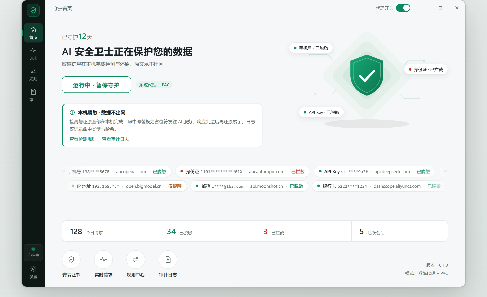
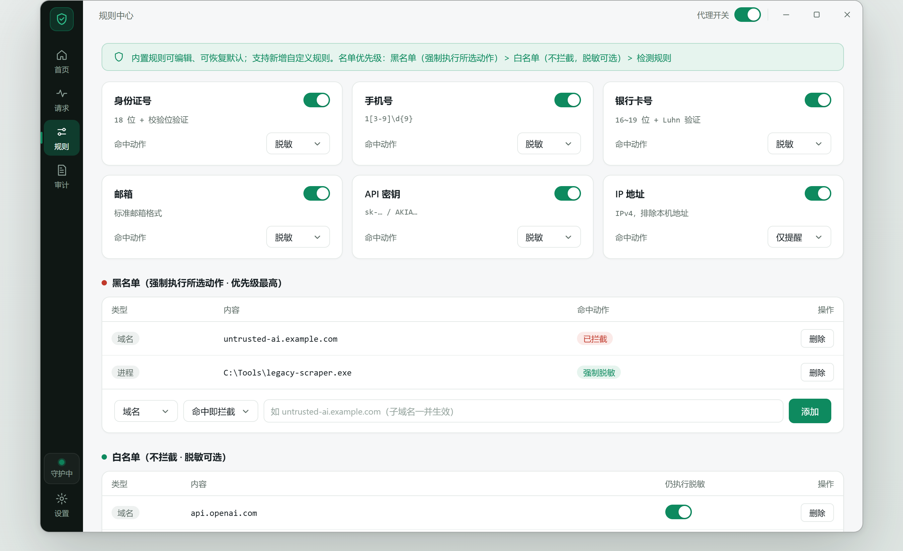
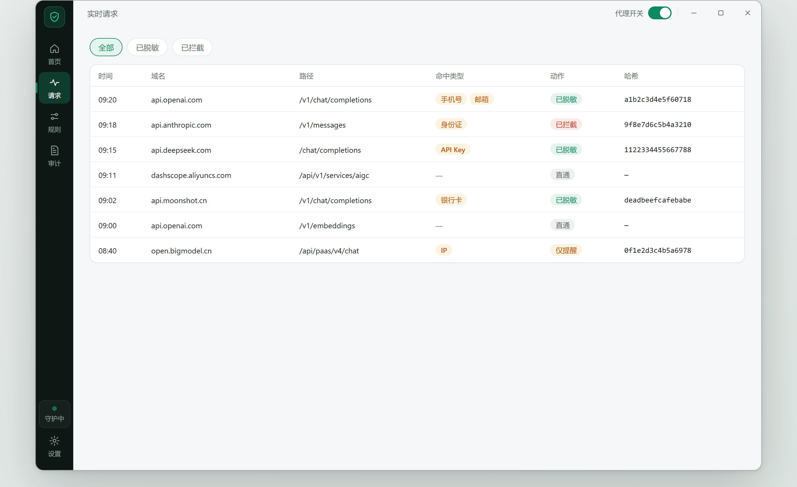
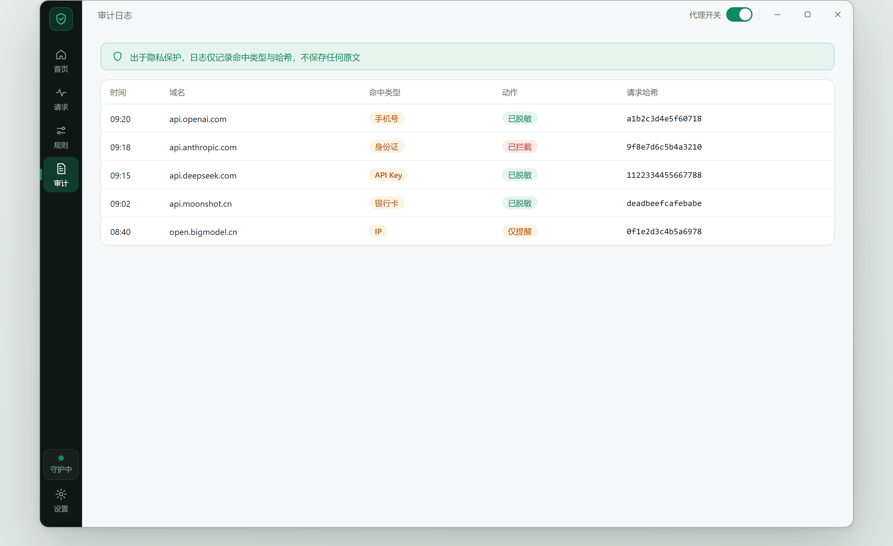
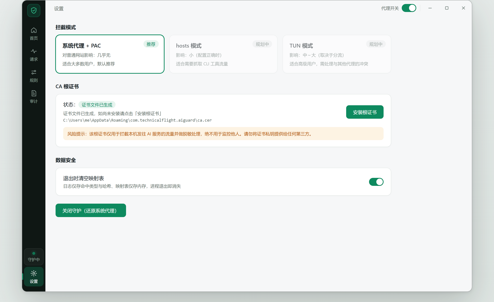
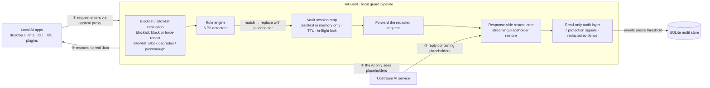

<div align="center">


# AiGuard

**A local-first AI traffic guard — your sensitive data never leaves your machine**

AiGuard intercepts requests bound for AI services on your own computer and swaps out ID numbers, phone numbers, API keys and
other sensitive values for reversible placeholders. When the AI reply comes back, those placeholders are streamed back into the
real data locally — **the original text never leaves the machine and never touches disk**.

[](https://www.rust-lang.org/)
[](https://tauri.app/)
[](https://react.dev/)
[](https://www.typescriptlang.org/)


[](./LICENSE)
[](https://github.com/Technicalflight/AiGuard/issues)

**[简体中文](./README.md) &nbsp;·&nbsp; [English](./README.en.md) &nbsp;·&nbsp; [Documentation](https://docs.qq.com/doc/p/81c44f2ceff3e2366c0dd8348f09599bc37a10f9)**

</div>

<div align="center"><a href="https://www.producthunt.com/products/aiguard?embed=true&amp;utm_source=badge-featured&amp;utm_medium=badge&amp;utm_campaign=badge-aiguard" target="_blank" rel="noopener noreferrer"></a></div>

> [!IMPORTANT]
> AiGuard is in early development (v0.1.x); configuration formats and internal interfaces may change at any time. The project is open source under **AGPL-3.0** — Stars, Issues and PRs are all welcome.

AiGuard is a **local-first** security gateway for AI traffic. It takes over HTTPS traffic destined for AI services through a
system proxy plus a self-signed root certificate, redacts sensitive data on the request side before anything goes out, restores
it while streaming the response back, and audits upstream behaviour in a read-only fashion throughout. Nothing is relayed to a
third party — **the guard pipeline runs on your own machine**.

---

## ✨ Features

### 🔁 Local MITM reverse proxy
- Automatic takeover via **system proxy + PAC**: only AI-domain traffic enters the guard pipeline, everything else connects directly
- Covers the **API and web** domains of OpenAI / Anthropic / DeepSeek / Moonshot / Zhipu and other mainstream AI services
- Decrypts HTTPS with a self-signed root CA, installed with **one click** from the settings page (into the current user's trust
  store — no admin rights — and revocable at any time)

### 🕵️ Request-side redaction
- **6 built-in detection rules**: national ID, phone number, bank card, email, API key, IP address
- Every rule can be toggled, its regex edited, and its action changed (redact / block / notify only); custom regex rules are supported
- Matches are replaced with reversible placeholders such as `[[PII:PHONE:8f3a2b1c]]` before being forwarded — **the AI never sees the real data**

### 🔄 Response-side streaming restore
- Placeholders in AI replies (including SSE streams) are restored to real data **frame by frame** on the local machine, invisibly to the user
- Look-ahead buffering handles placeholders split across TCP chunks; multi-byte characters are reassembled by an incremental UTF-8 decoder
- Gated by content-type / content-encoding: JSON / SSE / plain text enter the pipeline, binary and compressed traffic is passed through untouched

### 🛡️ Seven protection signals (read-only audit + active probing)
| Signal | Description |
|---|---|
| Error leak | Upstream error messages carry the user's original text |
| Model swap | The model identity in the request and the response disagree |
| Echo tampering | Placeholders in the response were rewritten or left behind |
| Stream anomaly | SSE stream integrity is broken |
| Response smuggling | The response carries content unrelated to this session |
| Memory residue | Upstream reused or stored session data across requests |
| Risky instruction | Detects instruction injection that could harm the machine |

- **Read-only audit**: findings are recorded but never rewrite the response; evidence holds only type / length / digest, written to SQLite above a severity threshold
- **Active probing**: injects a trace marker into a session and independently verifies whether upstream stores or echoes the data, producing a multi-dimensional risk matrix

### 📋 Blocklist / allowlist
- **Blocklist**: matched requests are forced into the chosen action (**403 block** or **force redact**), with the highest priority, overriding rules and the allowlist
- **Allowlist**: matched domains / programs are not blocked (a Block rule degrades to redaction); the "still redact" switch decides between passthrough and redaction
- Program entries can be picked **through the system file explorer** (exe or folder); requests are mapped back to a process path via the local TCP connection table
  (three match modes: full exe path / containing folder prefix / file name only; connections that cannot be resolved are treated as not listed)

### 🎨 Desktop-grade custom UI
- Tauri 2 frameless window: 42px title bar + 64px icon rail, deep-ink-green sidebar with a guardian-green design system
- Dropdowns, calendar, dialogs, switches and scrollbars are **all hand-drawn** — no native control residue

### 🧭 First-run wizard (certificate → proxy → rules)
- A three-step wizard opens automatically on first launch: **install root certificate → enable the guard → confirm detection rules**
- Every step reports **real state** (whether the certificate is in the trust store, whether the guard is running) instead of guessing locally
- **Every step can be skipped**: the wizard is a checklist, not a prerequisite; it can be re-run from settings at any time
- Versioned: the wizard replays once when the step set changes materially, with `setup.version` recording the completed version

### ⌨️ Global shortcuts
- Two actions can each be bound: **toggle the guard** / **emergency cut-off**, effective in any window
- Key combinations come only from a **preset allowlist** — global shortcuts are preemptive, so accepting arbitrary strings means one bad configuration silently eats a shortcut the user relies on
- Saving validates that the two actions do not collide; a **failed registration rolls back entirely** with a reason, never leaving a half-applied state where the settings claim "enabled" but the key does nothing
- Defaults are `Ctrl+Alt+G` / `Ctrl+Alt+X`, and the feature can be disabled wholesale from settings

### 🌐 Bilingual UI (Simplified Chinese / English)
- The UI language switches with **one click in settings**; in-window copy, the tray menu and desktop notifications share the same setting
- The dictionary is **keyed by the original Chinese text**: rewording English needs no changes at call sites, and Chinese diagnostics returned by the backend are translated by the same front-end table — no need to thread a language parameter through 40+ Tauri commands
- Entries containing `{}` are automatically promoted to "prefix + capture group" rules, so layered strings like `绑定 443 端口失败（…）: 拒绝访问` ("failed to bind port 443 (…): access denied") translate layer by layer
- Missing dictionary entries **fall back to Chinese** rather than emitting a wrong translation; `npm run i18n:check` reports "used at a call site but absent from the dictionary" as an error

### 🔄 Update check (off by default)
- **Off by default, and it sends no network request at all while off** — a privacy tool must not talk to the outside world before you turn it on
- Once enabled it checks 20 seconds after launch and then every 24 hours, sending **a single GET** to GitHub Releases with no local data attached (even the User-Agent only carries the app name and version)
- The update source is configurable (`owner/name`); "Check now" is an explicit user action and is not gated by the master switch
- Any failure is folded into a status field rather than throwing a red banner or disturbing other flows

---

## 🖼️ Screenshots

<table>
  <tr>
    <td width="50%"></td>
    <td width="50%"></td>
  </tr>
  <tr>
    <td align="center"><sub>Dashboard · guarded days / live redaction feed / data overview</sub></td>
    <td align="center"><sub>Rules · detection rule cards + blocklist / allowlist</sub></td>
  </tr>
  <tr>
    <td width="50%"></td>
    <td width="50%"></td>
  </tr>
  <tr>
    <td align="center"><sub>Requests · live redaction feed and detail</sub></td>
    <td align="center"><sub>Audit log · read-only evidence records</sub></td>
  </tr>
  <tr>
    <td width="50%"></td>
    <td align="center"><sub>Settings · interception mode / CA root certificate / data safety</sub></td>
  </tr>
</table>

---

## 🔒 How it works



**Request direction**: when a request targets an AI domain with a JSON content type, every string value is scanned recursively and
matches are replaced with placeholders. The same original text always yields the same placeholder within a session, keeping
multi-turn conversations consistent.

**Response direction**: placeholders in the AI reply are restored locally. In SSE streams a placeholder may be split across TCP
chunks, so the restore core uses look-ahead buffering: it only looks up and restores once the closing delimiter has arrived, holds
back half-open prefixes, and passes through over-long unclosed content (guarding against malicious unbounded buffering).

> **Privacy red line**: sensitive plaintext lives only in the in-memory session map (with TTL and in-flight locking, plus an
> optional "clear the map on exit"). Logs and audit events contain only type / length / digest / request hash — **no plaintext is
> written to disk and nothing is uploaded anywhere**.

---

## 🚀 Getting started

### Requirements

| Dependency | Version |
|---|---|
| Windows | 10 / 11 (x64) |
| macOS | 10.15+ (universal: Apple Silicon and Intel in one build) |
| Linux | x64 (deb / AppImage; needs the WebKitGTK 4.1 runtime) |
| Rust (MSVC / Xcode CLT / gcc) | 1.77+ |
| Node.js | 18+ |
| WebView2 Runtime | usually preinstalled on Win11 |

### Download

Grab the right artifact for your platform from the [Releases](https://github.com/Technicalflight/AiGuard/releases) page:

| Platform | Artifacts |
|---|---|
| Windows | `*-setup.exe` (NSIS wizard), `*.msi` |
| macOS | `*.dmg` (universal: Apple Silicon + Intel) |
| Linux | `*.deb`, `*.AppImage` |

> [!NOTE]
> The installers are not code-signed yet. Windows may show a SmartScreen prompt on first launch — click "Run anyway".
> On macOS, right-click the app and choose **Open** the first time (or allow it under System Settings → Privacy & Security).
> On Linux, `chmod +x` the AppImage before running.

### Platform differences

The guard core (MITM proxy, redaction, streaming restore, audit, bilingual UI) is **identical on all three platforms**;
the parts that talk to the operating system use native channels:

| Capability | Windows | macOS | Linux |
|---|---|---|---|
| System proxy (PAC) | registry + WinINET | `networksetup` (per network service) | GNOME `gsettings` |
| Root CA trust | `certutil -user` (current-user store) | `security add-trusted-cert` (login keychain) | NSS user store / system trust store |
| Root CA revocation | `certutil -delstore` | `security delete-certificate` | remove cert + rebuild trust store |
| hosts privilege elevation | UAC (PowerShell RunAs) | osascript authorisation prompt | `pkexec` (falls back to `sudo -n`) |
| CA private key at rest | DPAPI encryption | keychain (file holds a pointer only) | **plaintext + 0600** (no system keystore) |
| Data-directory permission check | `icacls` ACL | permission bits | permission bits |
| Debugger-attach detection | Win32 API | `sysctl` (P_TRACED) | `/proc` TracerPid |
| Process attribution | connection table + process handle | `lsof` | `/proc/net/tcp` |
| DNS cache flush | `ipconfig /flushdns` | `dscacheutil` + mDNSResponder | `resolvectl` |

> [!IMPORTANT]
> On Linux, without `gsettings` (non-GNOME desktops) or without polkit (`pkexec`), the corresponding capability reports
> exactly what must be done by hand — the guard never runs silently in a state where you *believe* traffic is protected
> while it actually goes out in plaintext. The transparent 443 layer (hosts mode) needs administrator / root rights on
> every platform.

### Run from source

```bash
git clone https://github.com/Technicalflight/AiGuard.git
cd AiGuard
npm install
npm run tauri dev
```

### Build an installer

```bash
npm run tauri build
# artifacts land in src-tauri/target/release/bundle/ (Windows: nsis + msi)
```

Per platform:

```bash
# macOS (universal: Apple Silicon + Intel in one build)
rustup target add aarch64-apple-darwin x86_64-apple-darwin
npm run tauri build -- --target universal-apple-darwin --bundles dmg

# Linux (deb + AppImage; needs the WebKitGTK 4.1 dev packages)
sudo apt-get install -y libwebkit2gtk-4.1-dev libappindicator3-dev librsvg2-dev patchelf
npm run tauri build -- --bundles deb,appimage
```

### Tests and self-checks

```bash
cargo test --workspace   # full Rust workspace tests (core + src-tauri)
npm run build            # front-end type check + bundle
npm run i18n:check       # dictionary self-check: keys vs call sites, missing translations
```

---

## 📖 Usage guide

1. **First-run wizard**: a "certificate → proxy → rules" wizard opens on first launch. Every step reads real state, and you can
   skip the whole thing — it is a checklist, not a prerequisite, and can be re-run from settings.
2. **Install the root certificate**: the first wizard step, or "Settings" → "CA root certificate" → "Install". The guard needs to
   decrypt HTTPS in order to detect and redact; the certificate only affects the current user's trust chain and can be revoked at
   any time.
3. **Enable the guard**: the second wizard step, or the proxy switch in the title bar. This configures the operating system's
   proxy with a PAC file (only AI domains go through the local proxy).
4. **Confirm detection rules**: the third wizard step shows the built-in rules and list priority; adjust them in "Rules".
5. **Use your AI apps normally**: no extra configuration — sensitive values are swapped out and replies restored automatically.
6. **Configure shortcuts**: "Settings" → "Global shortcuts", pick one key for "Toggle guard" and one for "Emergency cut-off"
   (choose from presets to avoid conflicts). If a key is taken by another program the UI shows "not in effect" and why.
7. **Switch UI language**: "Settings" → "Interface language" → English; window, tray menu and notifications follow.
8. **Tune the lists**: add blocklist / allowlist entries in "Rules". For program entries click "Browse file…" / "Browse folder…" to
   pick from the file explorer, or paste a path / domain directly.
9. **Watch the protection**: "Requests" shows the live redaction feed and details, "Audit" shows historical evidence, and the
   dashboard shows overall state.
10. **Update check (optional)**: enable it in "Settings" → "Check for updates". **Off by default, and no network request is made
    while off**; once on it queries GitHub Releases once every 24 hours with no local data. You can also click "Check now" at any time.

---

## 🧱 Project layout

```
AiGuard/
├── Cargo.toml               # workspace root (core + src-tauri)
├── core/                    # Rust pure-logic layer (aiguard-core, testable on its own)
│   └── src/
│       ├── detector.rs      # sensitive-data detection engine (regex + semantic validation)
│       ├── vault.rs         # plaintext ↔ placeholder map (session-isolated + TTL, memory only)
│       ├── stream.rs        # streaming restore state machine (look-ahead buffering)
│       ├── sse.rs           # SSE frame state machine (framing / validation / buffer caps)
│       ├── audit.rs         # pure detection layer for the 7 protection signals (read-only)
│       ├── inspect.rs       # active-probe plans, risk matrix and audit reports
│       ├── secure.rs        # restore pipeline + audit context collection
│       └── mem.rs           # proactive wiping of sensitive memory
├── src-tauri/               # Tauri 2 application layer
│   └── src/
│       ├── main.rs          # entry: open store → build state → generate CA → start proxy → register commands / shortcuts
│       ├── state.rs         # AppState, CA generation, AI domain table, lists, wizard / shortcut / update config
│       ├── proxy.rs         # hudsucker MITM engine (redact / block / restore)
│       ├── transparent.rs   # hosts-mode transparent interception (SNI → dynamic cert → bridge to local proxy)
│       ├── hosts.rs         # hosts-file marker block write / remove (per-platform elevation)
│       ├── dns.rs           # DNS lookups bypassing the system resolver (hosts-mode companion)
│       ├── process.rs       # client process identification (connection table → PID → executable path)
│       ├── proxy_config.rs  # system proxy on three platforms (registry / networksetup / gsettings) + PAC generation
│       ├── security.rs      # local hardening: debugger detection, system-protected CA key at rest, port diagnostics
│       ├── store.rs         # SQLite persistence: request log / audit events / kv config (no plaintext)
│       ├── link_check.rs    # active-probe executor (trace-marker injection + echo verification)
│       ├── console.rs       # external command output decoding (Windows code page → UTF-8; passthrough on unix)
│       ├── i18n.rs          # out-of-window copy (tray / notifications) in Chinese and English
│       └── commands.rs      # Tauri commands + events
├── src/                     # React + TypeScript front end (Vite)
│   ├── App.tsx              # every screen: dashboard / requests / rules / protection / audit / settings + first-run wizard
│   ├── api.ts               # Tauri command wrappers (with a MOCK source for browser preview)
│   ├── i18n.ts              # i18n core (t / tb / language subscription)
│   ├── i18n-dict-ui.ts      # UI dictionary (key = original Chinese text)
│   ├── i18n-dict-backend.ts # backend diagnostic dictionary (translates Err(String) for the UI)
│   ├── i18n-dict-runtime.ts # Chinese produced at runtime (concatenations, system output)
│   └── ui.css               # design system (hand-drawn control styles, shared with preview/)
├── preview/                 # static UI mockups (same source as src/ui.css, opens on double click)
├── docs/                    # README assets: logo, screenshots, i18n audit notes
└── scripts/                 # developer tooling
    ├── i18n_extract.mjs     # rewrites Chinese literals in App.tsx into t(...) and maintains the UI dictionary
    ├── i18n_rs_extract.mjs  # extracts UI-bound Chinese from Rust, maintains the BACKEND dictionary
    ├── i18n_merge.mjs       # merges a batch of translations (sorts, decides the owning dictionary)
    ├── i18n_check.mjs       # dictionary self-check: keys vs call sites, missing translations
    ├── i18n_locale_check.mjs# verifies window title and <html lang> stay in sync
    ├── i18n_e2e.mjs         # real-browser end-to-end scan (14 screens + native attributes)
    └── rust_scan.mjs        # Rust Chinese-literal scanner shared by the scripts above
```

---

## ⚠️ Known limitations

- hosts mode and TUN mode are not implemented yet (marked "planned" in the UI).
- Applications using certificate pinning cannot be intercepted and are passed through automatically (so they keep working).
- QUIC / HTTP3 (UDP) traffic does not go through the system proxy; disable QUIC in the browser (e.g. `chrome://flags`) for full coverage.
- Placeholders for the same text differ across sessions: conversations restore independently, so do not copy a placeholder into another session.
- **Linux**: with no system keystore available, the CA private key is stored as plaintext with 0600 permissions (the hardening
  panel reports it honestly as "plaintext"); on non-GNOME desktops or without polkit, the system proxy and hosts elevation
  must be completed manually as instructed.

---

## 🛣️ Roadmap

- [x] Bilingual UI (Simplified Chinese / English)
- [x] First-run wizard (certificate → proxy → rules)
- [x] Global shortcuts (toggle guard / emergency cut-off)
- [x] Update check (off by default, never phones home unasked)
- [ ] More built-in rules (JWT, PEM private keys, AWS access keys, connection-string passwords, …)
- [ ] Process attribution and per-channel statistics for audit events
- [ ] Upstream egress proxy support (enterprise networks)
- [ ] Historical trend reports for active probing

---

## 🤝 Contributing

AiGuard is a **security tool**, and the contributions it welcomes go well beyond code. Every one of these is equally valuable:

| Type | Description |
|---|---|
| 🐛 **Bug reports** | Reproduction steps + version + environment; the more specific the better |
| 💡 **Feature ideas** | The real scenario you want solved helps far more than "add a button" |
| 🧠 **Design discussions** | Trade-offs in proxy architecture, streaming restore, list matching — talk first, code later |
| 🔐 **Security design** | Detection rules, bypass resistance, threat modelling, new audit signals |
| 📖 **Docs and translation** | Wording, screenshots, and improvements to the guides |
| 🔧 **Code** | New detection rules, performance work, UI polish |

Please read **[CONTRIBUTING.md](./CONTRIBUTING.md)** before you start; by taking part you agree to follow the
**[CODE_OF_CONDUCT.md](./CODE_OF_CONDUCT.md)**.

> [!WARNING]
> **Please do not open a public issue for security vulnerabilities** — report them privately as described in **[SECURITY.md](./SECURITY.md)**.

---

## 💬 Community

- **[GitHub Issues](https://github.com/Technicalflight/AiGuard/issues)** — the main channel for bugs, feature requests and design discussions
- **[GitHub Discussions](https://github.com/Technicalflight/AiGuard/discussions)** — open questions and shared experience
- **[Linux.Do](https://linux.do)** — a community for sharing and discussing technology

---

## 📦 Built on open source

AiGuard stands on these excellent open-source projects:

[Tauri](https://tauri.app) · [React](https://react.dev) · [Vite](https://vite.dev) · [TypeScript](https://www.typescriptlang.org) ·
[hudsucker](https://github.com/omjadas/hudsucker) · [hyper](https://hyper.rs) · [tokio](https://tokio.rs) ·
[rustls](https://github.com/rustls/rustls) · [rcgen](https://github.com/rustls/rcgen) · [rusqlite](https://github.com/rusqlite/rusqlite) ·
[serde](https://serde.rs) · [regex](https://github.com/rust-lang/regex) and many more crates from the Rust ecosystem.

If AiGuard works well for you, consider giving those upstream projects a Star too — they have earned it.

---

## ☕ Sponsor

If AiGuard helps you, you are welcome to buy the author a coffee or a coke ☕🥤 — every cup fuels continued development.

<p align="center">
  
  &nbsp;&nbsp;&nbsp;&nbsp;&nbsp;&nbsp;
  
</p>
<p align="center"><sub>Left: Alipay &nbsp;·&nbsp; Right: WeChat Pay</sub></p>

> [!WARNING]
> **Please read before sponsoring**: sponsorship is a **purely voluntary** gesture of thanks. **It will not raise or accelerate the
> priority of any feature, bug fix or other work** — all development follows the roadmap and community needs, entirely independent
> of whether or how much you sponsor. Sponsorship is a thank-you only and grants no commercial licence, priority support or any
> other additional commitment.

---

## ⚠️ Disclaimer

- This project is a **learning and research** security tool and is not affiliated with any AI service provider mentioned here.
- Use it only on devices and networks you are authorised to use, and comply with local laws and the target service's terms of
  service; using it to monitor other people's traffic or to bypass security mechanisms on devices you do not own is prohibited.
- The software is provided "as is", **without warranty of any kind, express or implied**; the author is not liable for any
  consequences arising from its use.

---

## License

AiGuard is licensed under the **GNU Affero General Public License v3.0 (AGPL-3.0)**, available at <https://www.gnu.org/licenses/agpl-3.0.html> — see the [LICENSE](./LICENSE) file for the full text.

Use of AiGuard for **commercial purposes is permitted**, subject to full compliance with the terms and conditions of the AGPL-3.0 license — including its network-use clause: if you modify AiGuard and offer it as a network service, you must make the complete corresponding source code available to the users of that service.

Should you require a **commercial license** that provides an exemption from the AGPL-3.0 requirements (e.g. closed-source or internal deployment without the source-disclosure obligations), please open an issue at <https://github.com/Technicalflight/AiGuard/issues> to contact the author.

---

中文说明：本项目社区版采用 **AGPL-3.0** 许可证。你可以自由地使用、学习、修改和分发本项目（包括商业用途），但必须完整遵守 AGPL-3.0 全部条款——尤其是**网络服务条款**：修改后的版本若以网络服务形式提供给他人使用，必须向使用者提供完整的对应源代码。如需**豁免上述开源义务的商业授权**（如闭源部署、OEM 集成），请通过 [GitHub Issues](https://github.com/Technicalflight/AiGuard/issues) 联系作者洽谈。

Copyright © 2026 Technicalflight
