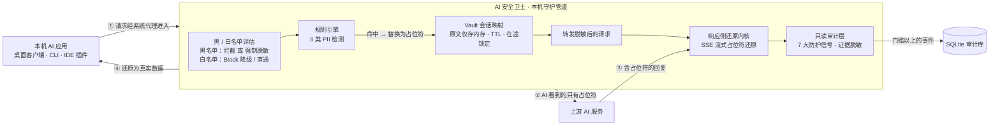

<div align="center">


# AI 安全卫士 · aiguard

**敏感信息不出本机的 AI 流量守护工具**

在本地拦截发往 AI 服务的请求，自动把身份证、手机号、API Key 等敏感信息替换为可还原的占位符；
AI 回复到达后，在本地流式还原为真实数据 —— **原文永不出网、永不落盘**。

[](https://www.rust-lang.org/)
[](https://tauri.app/)
[](https://react.dev/)
[](https://www.typescriptlang.org/)

[](./LICENSE)

</div>

---

## ✨ 核心特性

### 🔁 本机 MITM 反向代理
- 基于 **系统代理 + PAC** 自动接管：仅 AI 域名流量进入守护管道，其余流量直连不受影响
- 覆盖 OpenAI / Anthropic / DeepSeek / Moonshot / 智谱 等主流 AI 服务的 **API 与网页端**域名
- 使用自签根证书解密 HTTPS，证书由设置页**一键安装**（certutil 装入当前用户存储，无需管理员权限），随时可撤销

### 🕵️ 请求侧敏感信息脱敏
- 内置 **6 类检测规则**：身份证 / 手机号 / 银行卡 / 邮箱 / API Key / IP 地址
- 每条规则可独立开关、可编辑正则、可改命中动作（脱敏 / 拦截 / 仅提醒），支持自定义正则扩展
- 命中内容替换为形如 `[[PII:PHONE:8f3a2b1c]]` 的**可还原占位符**后发往 AI 服务 —— AI 永远看不到真实数据

### 🔄 响应侧流式还原
- AI 回复（含 SSE 流式输出）中的占位符在本地**逐帧还原**为真实数据，用户无感知
- 前瞻缓冲处理占位符被 TCP 拆分到多个 chunk 的情况；多字节字符由增量 UTF-8 解码器拼接
- 按 content-type / content-encoding 设置门槛：JSON / SSE / 明文进管道，二进制与压缩流量原样透传

### 🛡️ 七大防护信号（只读审计 + 主动核查）
| 信号 | 说明 |
|---|---|
| 报错泄密 | 上游错误信息中夹带用户原文 |
| 模型偷换 | 请求与响应的模型身份不一致 |
| 复读篡改 | 响应中占位符被改写或残留 |
| 流式异常 | SSE 流完整性异常 |
| 响应夹带 | 响应中夹带与本次会话无关的内容 |
| 记忆残留 | 上游跨请求复用 / 存储了会话数据 |
| 高危指令 | 检测可能危害本机的指令注入 |

- **只读审计**：发现只记录、不改写响应；证据仅含类型 / 长度 / 摘要，按严重度门槛写入 SQLite
- **主动核查**：向会话注入追踪标记并独立验证「上游是否存储 / 回显数据」，输出多维风险矩阵

### 📋 黑名单 / 白名单
- **黑名单**：命中后强制执行所选动作（**403 拦截** 或 **强制脱敏**），优先级最高，覆盖规则与白名单
- **白名单**：命中的域名 / 程序不执行拦截（Block 规则降级为脱敏），「仍执行脱敏」开关决定直通或脱敏
- 进程名单支持**调用系统资源管理器选择 exe / 文件夹**，通过本机 TCP 连接表把请求反解到进程路径后匹配
  （exe 完整路径 / 所在文件夹前缀 / 仅文件名，三种匹配方式；识别失败的连接按不在名单处理）

### 🎨 桌面级自定义界面
- Tauri 2 自定义无边框窗口：42px 标题栏 + 64px 图标导航栏，深墨绿侧栏 + 守护绿设计系统
- 下拉、日历、弹窗、开关、滚动条**全部自绘**，无任何原生控件残留

### 🧭 首次运行向导（证书 → 代理 → 规则）
- 首次启动自动弹出三步向导：**安装根证书 → 开启守护 → 确认检测规则**
- 每一步都显示**真实状态**（证书是否已在信任库、守护是否已开启），不靠本地猜测
- **每一步都能跳过**：向导只是检查清单，不构成使用前提；设置页可随时「重新运行」
- 向导版本化：步骤集合发生实质变化时会自动重放一次，`setup.version` 记录完成时的版本

### ⌨️ 全局快捷键
- 两个动作可各自绑定键位：**开关守护** / **一键应急切断**，任意窗口下生效
- 键位只从**预设白名单**中挑选——全局快捷键是抢占式的，放开任意字符串等于让一次误配置吞掉用户某个常用组合
- 保存时校验「两个动作不能撞键」；**注册失败整体回滚**并提示原因，绝不留下「设置里写着已启用、按键却毫无反应」的半套状态
- 默认 `Ctrl+Alt+G` / `Ctrl+Alt+X`，可在设置页整体关闭

### 🌐 多语言（简体中文 / English）
- 界面语言在**设置页一键切换**，窗口内文案、系统托盘菜单、桌面通知共用同一份设置
- 词典以**中文原文为键**：改英文措辞不需要动任何调用点；后端返回的中文诊断由前端同一张表翻译，无需给 40 多个 Tauri 命令各加一轮语言参数
- 带 `{}` 的条目自动升级为「前缀 + 捕获组」规则，能逐层翻译 `绑定 443 端口失败（…）: 拒绝访问` 这类「模板 + 内层原因」
- 词典缺失的片段**回退中文**而不是输出错译；`npm run i18n:check` 把「调用点在用但词典没有」的键当成错误报出来

### 🔄 自动更新检查（默认关闭）
- **默认整体关闭，关闭时一次网络请求都不发**——隐私工具不允许「未经开启就对外通信」
- 开启后启动 20 秒检查一次、之后每 24 小时一次，只向 GitHub Releases 发**一个 GET**，不带任何本机数据（连 User-Agent 也只写应用名与版本）
- 更新源可改（`owner/name`）；「立即检查」是用户明确点击的动作，不受总开关限制
- 任何失败都折叠进状态字段展示，不会因为网络不通而弹红字或影响其它流程

---

## 🖼️ 运行界面

<table>
  <tr>
    <td width="50%"></td>
    <td width="50%"></td>
  </tr>
  <tr>
    <td align="center"><sub>守护首页 · 已守护天数 / 实时脱敏流水 / 数据总览</sub></td>
    <td align="center"><sub>规则中心 · 检测规则卡片 + 黑 / 白名单</sub></td>
  </tr>
  <tr>
    <td width="50%"></td>
    <td width="50%"></td>
  </tr>
  <tr>
    <td align="center"><sub>请求监控 · 实时脱敏流水与详情</sub></td>
    <td align="center"><sub>审计日志 · 只读证据记录</sub></td>
  </tr>
  <tr>
    <td width="50%"></td>
    <td align="center"><sub>系统设置 · 拦截模式 / CA 根证书 / 数据安全</sub></td>
  </tr>
</table>

---

## 🔒 工作原理



**请求方向**：请求发往 AI 域名且 Content-Type 为 JSON 时，递归扫描所有字符串值，命中的原文替换为占位符。
同一会话内同一原文永远得到同一占位符，保证多轮对话一致性。

**响应方向**：AI 回复中的占位符在本机被还原为原文。SSE 流式响应中占位符可能被 TCP 拆到不同 chunk，
还原内核用前瞻缓冲处理：凑齐闭合符才查表还原，半截前缀扣留不发，超长未闭合内容直接放行（防恶意无限缓冲）。

> **隐私红线**：敏感原文只存在于本机内存的会话映射中（带 TTL 与在途锁定，可开启「退出时清空映射表」）；
> 日志与审计事件仅包含类型 / 长度 / 摘要 / 请求哈希，**任何环节不落盘原文、不上传任何数据**。

---

## 🚀 快速开始

### 环境要求

| 依赖 | 版本 |
|---|---|
| Windows | 10 / 11（x64） |
| Rust（MSVC 工具链） | 1.77+ |
| Node.js | 18+ |
| WebView2 Runtime | Win11 一般自带 |

### 从源码运行

```bash
git clone https://github.com/Technicalflight/aiguard.git
cd aiguard
npm install
npm run tauri dev
```

### 构建安装包

```bash
npm run tauri build
# 产物位于 src-tauri/target/release/bundle/
```

### 纯逻辑单元测试（无需 Tauri 环境）

```bash
cargo test -p aiguard-core
```

---

## 📖 使用指南

1. **首次运行向导**：首次启动会自动弹出「证书 → 代理 → 规则」三步向导。每一步都会读取真实状态，
   也可以直接「跳过向导」——向导只是检查清单，跳过不影响任何功能；设置页可随时「重新运行」。
2. **安装根证书**：向导第一步，或进入「设置」→「CA 根证书」→「安装根证书」。守护管道需要解密 HTTPS
   才能检测 / 脱敏；证书仅影响本机当前用户信任链，可随时撤销。
3. **开启守护**：向导第二步，或打开标题栏「代理开关」，自动写入 Windows 系统代理 + PAC 文件
   （仅 AI 域名走本地代理）。
4. **确认检测规则**：向导第三步展示内置规则与名单优先级，可到「规则中心」按需调整。
5. **正常使用 AI 应用**：无需任何额外配置，敏感信息自动替换、回复自动还原。
6. **配置快捷键**：进入「设置」→「全局快捷键」，为「开关守护」和「一键应急切断」各选一个键位
   （从预设中挑，避免与常用组合冲突）。键位被其它程序占用时界面会显示「未生效」及原因。
7. **切换界面语言**：进入「设置」→「界面语言」选 English，窗口、托盘菜单与桌面通知同步切换。
8. **按需配置名单**：在「规则中心」添加黑 / 白名单。进程类名单点击「浏览文件…」/「浏览文件夹…」
   从资源管理器选择，也可以粘贴路径或填写域名。
9. **查看防护情况**：「请求页」看实时脱敏流水与详情，「审计页」看历史证据，「守护首页」看整体状态。
10. **自动更新检查（可选）**：进入「设置」→「自动检查更新」打开。**默认关闭，关闭时不会发起任何网络请求**；
    开启后每 24 小时向 GitHub Releases 查一次新版本，不带任何本机数据。也可以随时点「立即检查」手动查一次。

---

## 🧱 项目结构

```
aiguard/
├── Cargo.toml              # workspace 根（core + src-tauri）
├── core/                   # Rust 纯逻辑层（aiguard-core，可独立 cargo test）
│   └── src/
│       ├── detector.rs     # 敏感信息检测引擎（正则 + 语义校验）
│       ├── vault.rs        # 原文 ↔ 占位符映射（会话隔离，仅内存）
│       ├── stream.rs       # 流式还原状态机（前瞻缓冲）
│       ├── audit.rs        # 7 大防护信号检测（纯检测层）
│       └── probe.rs        # 主动核查计划与风险矩阵
├── src-tauri/              # Tauri 2 应用层
│   └── src/
│       ├── main.rs         # 入口：启动代理 + 注册命令 + 注册快捷键 + 定时更新检查
│       ├── state.rs        # AppState、CA 生成、AI 域名表、黑/白名单、向导 / 快捷键 / 更新配置
│       ├── proxy.rs        # hudsucker MITM 引擎（脱敏 / 拦截 / 还原）
│       ├── process.rs      # 客户端进程识别（TCP 连接表 → PID → exe 路径）
│       ├── store.rs        # SQLite 审计存储（不存原文）
│       ├── proxy_config.rs # Windows 注册表系统代理 + PAC
│       ├── i18n.rs         # 窗口外界面（托盘 / 通知）的中英文表，按 Language 取词
│       └── commands.rs     # Tauri 命令 + 事件
├── src/                    # React + TypeScript 前端（Vite）
│   ├── App.tsx             # 全部界面：首页 / 请求 / 规则 / 防护 / 审计 / 设置 + 首次运行向导
│   ├── i18n.ts             # 多语言内核（t / tb / 语言订阅）
│   ├── i18n-dict-ui.ts     # 前端文案词典（键 = 中文原文）
│   └── i18n-dict-backend.ts# 后端诊断文案词典（翻译 Err(String) 回到界面的中文）
├── preview/                # 静态界面设计稿（与 src/ui.css 同源，双击即开）
├── docs/                   # README 素材：logo 与运行界面截图
└── scripts/                # 开发工具脚本
    ├── i18n_extract.mjs    # 把 App.tsx 的中文文案改写为 t(...) 并维护 UI 词典
    ├── i18n_rs_extract.mjs # 抽取 Rust 侧会进界面的中文，维护 BACKEND 词典
    ├── i18n_merge.mjs      # 合并一批译文（自动排序、自动判断归属词典）
    └── i18n_check.mjs      # 词典自检：键与调用点是否对齐、有无漏译
```

---

## ⚠️ 已知限制

- hosts 模式与 TUN 模式尚未实现（界面中标记「规划中」）。
- 启用了证书固定（pinning）的应用无法被拦截，会自动放行（不破坏其工作）。
- QUIC / HTTP3（UDP）流量不走系统代理，需在浏览器侧禁用 QUIC（如 `chrome://flags`）才能完整覆盖。
- 同一原文的占位符在不同会话间不同：跨会话的对话各自独立还原，请勿手动复制占位符到其他会话。

---

## 🛣️ Roadmap

- [x] 多语言界面（简体中文 / English）
- [x] 首次运行向导（证书 → 代理 → 规则）
- [x] 全局快捷键（开关守护 / 一键应急切断）
- [x] 自动更新检查（默认关闭，不默认上报）
- [ ] 更多内置检测规则（JWT、PEM 私钥、AWS Access Key、连接串密码等）
- [ ] 审计事件的进程归因与按渠道统计
- [ ] 出口代理支持（企业网络环境）
- [ ] 主动核查历史趋势报告

---

## ⚠️ 免责声明

- 本项目为**学习研究性质**的安全工具，与文中提及的任何 AI 服务商均无关联。
- 请仅在你拥有合法授权的设备与网络环境中使用，并遵守当地法律法规与目标服务的用户协议；
  禁止用于监控他人流量或绕过他人设备的安全机制。
- 软件按「现状」提供，**不附带任何明示或默示的担保**；作者不对因使用本软件产生的任何后果负责。

---

## 📄 License

[MIT](./LICENSE) © 2026 Technicalflight
